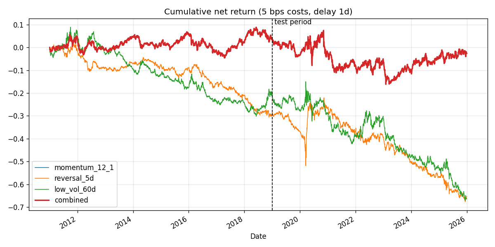
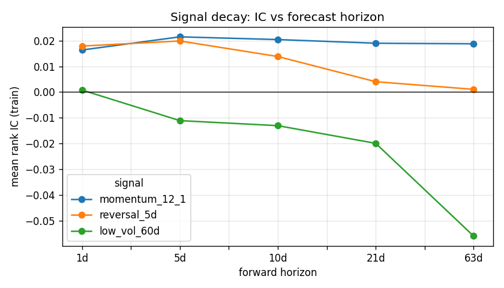

# Results

Data: 62 US large caps via yfinance. Costs 5 bps per unit turnover, execution delay 1 day(s).
Train: 2011-01-03 to 2019-01-01 | Test: 2019-01-01 to 2025-12-30

## Out-of-sample Sharpe decay (net of costs)
| signal | train | test | decay |
|---|---|---|---|
| combined | 0.101 | -0.119 | -0.220 |
| low_vol_60d | -0.420 | -0.711 | -0.291 |
| momentum_12_1 | 0.101 | -0.119 | -0.220 |
| reversal_5d | -0.799 | -0.630 | 0.169 |

Combination weights (fitted on train only): momentum_12_1=1.00, reversal_5d=0.00, low_vol_60d=0.00

## Full metrics
| signal / period | ann_return | ann_vol | sharpe | t_stat | max_drawdown | hit_rate | daily_turnover |
|---|---|---|---|---|---|---|---|
| momentum_12_1 / train | 0.006 | 0.056 | 0.101 | 0.285 | -0.115 | 0.524 | 0.090 |
| momentum_12_1 / test | -0.010 | 0.085 | -0.119 | -0.314 | -0.236 | 0.520 | 0.091 |
| reversal_5d / train | -0.037 | 0.047 | -0.799 | -2.258 | -0.328 | 0.466 | 0.580 |
| reversal_5d / test | -0.051 | 0.081 | -0.630 | -1.664 | -0.456 | 0.455 | 0.569 |
| low_vol_60d / train | -0.026 | 0.063 | -0.420 | -1.188 | -0.391 | 0.475 | 0.064 |
| low_vol_60d / test | -0.065 | 0.091 | -0.711 | -1.878 | -0.523 | 0.479 | 0.064 |
| combined / train | 0.006 | 0.056 | 0.101 | 0.285 | -0.115 | 0.524 | 0.090 |
| combined / test | -0.010 | 0.085 | -0.119 | -0.314 | -0.236 | 0.520 | 0.091 |

## Mean rank IC by forecast horizon (train)
| signal | 1d | 5d | 10d | 21d | 63d |
|---|---|---|---|---|---|
| momentum_12_1 | 0.0163 | 0.0214 | 0.0204 | 0.0190 | 0.0187 |
| reversal_5d | 0.0179 | 0.0198 | 0.0138 | 0.0040 | 0.0011 |
| low_vol_60d | 0.0008 | -0.0111 | -0.0130 | -0.0199 | -0.0559 |

## Cost sensitivity: train Sharpe at different cost levels
| signal | 0bps | 2bps | 5bps | 10bps | 20bps |
|---|---|---|---|---|---|
| momentum_12_1 | 0.306 | 0.224 | 0.101 | -0.105 | -0.515 |
| reversal_5d | 0.773 | 0.144 | -0.799 | -2.368 | -5.486 |
| low_vol_60d | -0.292 | -0.343 | -0.420 | -0.549 | -0.806 |

